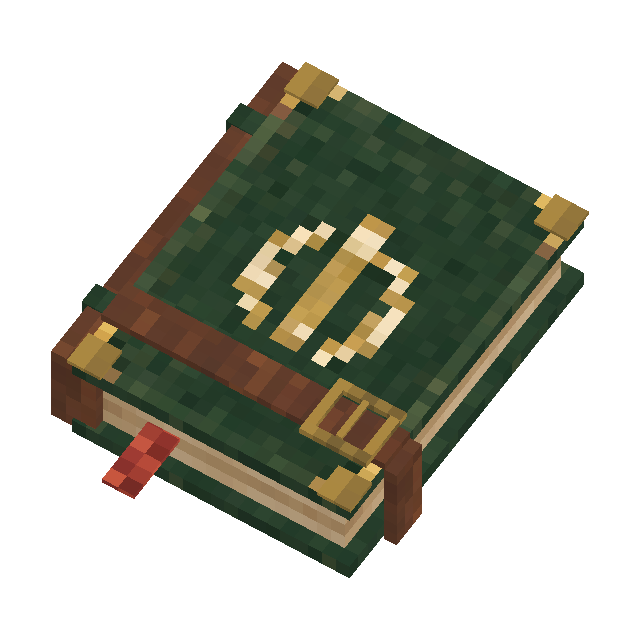

<p align="center">
  
</p>

<h1 align="center">Restock &amp; Roam</h1>

<p align="center">
  Turn expedition returns into one interaction: store new loot, refill supplies, and restore your equipment layout.
</p>

<p align="center">
  
  
  <a href="LICENSE"></a>
</p>

## What it does

Restock & Roam is a server-side Hytale mod for solo worlds, friend-hosted worlds, and dedicated servers. Players save personal equipment kits and connect them to a base made of linked chests.

When a player crouches and interacts with any chest in that base, the mod can:

- Deposit only the items gained since departure
- Route loot into filtered storage chests
- Refill food, potions, ammunition, and other saved supplies
- Save and restore hotbar, inventory, backpack, armor, utility, and tool slots
- Keep overflow with the player for the next attempt
- Track each player's kit and trip separately on a shared base

Normal chest interaction is unchanged when the player is not crouching.

## Expedition Ledger

The Expedition Ledger is the mod's in-game access item. It has its own model and texture, uses the native spellbook animation, cannot be crafted, and can be claimed for free from the Overview page.

Use the Ledger's secondary action to open Restock & Roam without typing a command.

<p align="center">
  
</p>

## Quick start

1. Run `/eprep` and click `Claim Expedition Ledger`.
2. Open `Kits`, arrange what you want to take in your equipment, inventory, and backpack, then save the kit.
3. Open `Base`, click `Link primary`, then interact with your main chest.
4. Optionally link more chests within 16 blocks and configure their roles and filters.
5. Select the kit on the Overview page and click `Use this kit`.
6. Crouch and interact with any linked chest to prepare the first departure.
7. After exploring, return to the same base and repeat the interaction to store new loot and restock.

## Chest roles

| Role | Purpose |
| --- | --- |
| `SUPPLY` | Provides items when a kit needs to be refilled |
| `LOOT` | Receives items gained during the trip |
| `BOTH` | Can provide supplies and receive loot |

Rules support exact item IDs, item categories, resource IDs, priorities, and fallback chests. The primary chest starts as `BOTH` and acts as a fallback.

## Commands

| Command | Purpose |
| --- | --- |
| `/expedition` | Open the Restock & Roam interface |
| `/eprep` | Short alias |
| `/restock` | Alternative alias |
| `/rr` | Alternative alias |

## Permissions

| Permission | Purpose |
| --- | --- |
| `expeditionprep.admin` | Inspect and recover trip tracking, manage administrative access, and receive update notices |

Base owners manage linked chests and guests. Invited guests can use the base with their own kits and trip snapshots.

## Optional compatibility

[BetterClaim](https://www.curseforge.com/hytale/mods/betterclaim) is supported as an optional dependency. When it is installed, linked secondary chests also respect its chest interaction permission.

## Configuration

The plugin creates `mods/durkz_RestockAndRoam/config.json` in the active Hytale server or world data directory. Existing installations keep using `mods/durkz_ExpeditionPrep/` to preserve saved kits, bases, and trips.

```json
{
  "checkForUpdates": true
}
```

Update notices are sent once per session to operators or players with `expeditionprep.admin`. The check can be disabled without affecting any expedition feature.

## Build from source

Requirements:

- Java 25
- A local Hytale release installation containing `HytaleServer.jar`

On Windows:

```powershell
.\gradlew.bat clean test jar --no-daemon
```

The server JAR is resolved from `%AppData%\Hytale\install\release\package\game\latest\Server\HytaleServer.jar` and is used only as a compile-time dependency. It is never packaged inside the mod.

Build output: `build/libs/RestockAndRoam-1.0.0.jar`

## Support

Please report problems through the [DurkzPRG issue tracker](https://durkzprgmods.pages.dev/issues/).

## License

MIT. Copyright (c) 2026 DurkzPRG.
